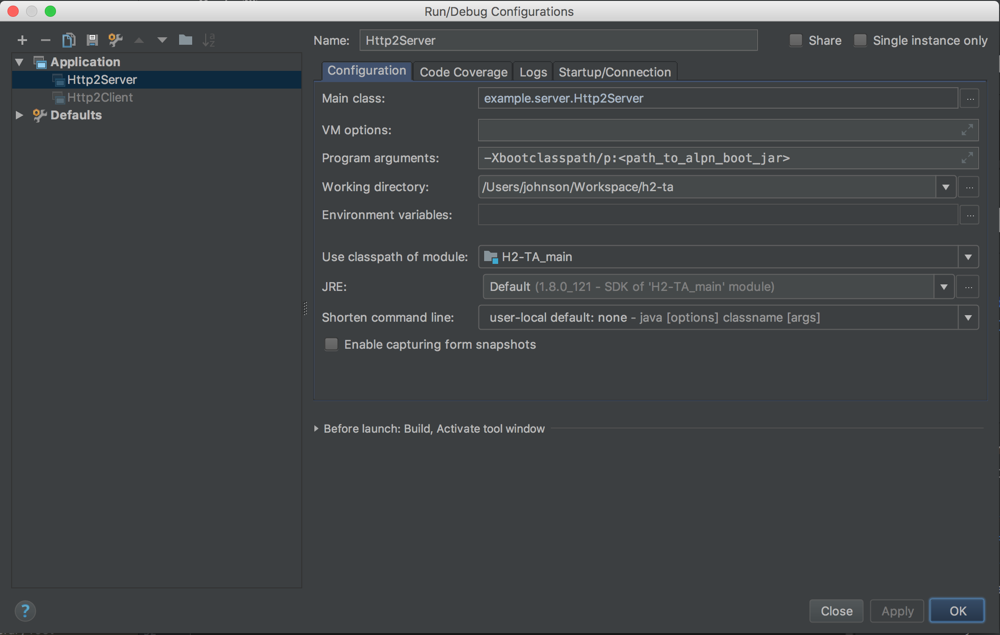

Get the code
===
```bash
git clone https://github.com/johnson-li/H2-TA.git
```

Install JDK
===

Follow the guide 
https://www3.ntu.edu.sg/home/ehchua/programming/howto/JDK_Howto.html


For ALPN
===
HTTP/2 requires some encryption algorithms that is not included in Java. There are two ways to add such component. The detailed guide is on 
 https://netty.io/wiki/forked-tomcat-native.html. Briefly, the solution is either the native way or the Java way.

 - Native way
    
    Install `openssl` & `libapr-1`
    
    - For MaxOS
    ```bash
    brew install apr-util openssl
    ```
    - For Linux
    ```bash
    apt-get install libssl-dev libapr1-dev
    ```
     
 - Java way 
 
    The detailed instruction is located [here](https://www.eclipse.org/jetty/documentation/current/alpn-chapter.html). 
    Briefly, you should 
    1. Download the corresponding ALPN according to your JDK version. All of the ALPN jars are available in the [maven repository](https://mvnrepository.com/artifact/org.mortbay.jetty.alpn/alpn-boot).
    I.E. if your JDK version is 1.8.0u152, please use the ALPN version 8.1.11.v20170118
    2. Add the ALPN jar to your boot classpath. The command is like:
    ```bash
    java -Xbootclasspath/p:<path_to_alpn_boot_jar> ...
    ```
                               


IDE
===
A good IDE can help you work efficiently, we suggest using [Intellij](https://www.jetbrains.com/idea/).

If you are using the Java way of ALPN, you should edit run configurations and set the programme arguments.


### Import project
File -> Open -> Choose /path/of/h2-ta/build.gradle -> Choose 'Open as Project'

