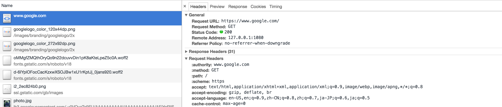

GOAL
===
Have a glance on HTTP/2 in the Internet.

GUIDE
===
1. Open chrome, open the [developer panel](https://developers.google.com/web/tools/chrome-devtools/console/). HTTP/2 supported sites should look like

2. Install [HTTP/2 and SPDY indicator](
https://chrome.google.com/webstore/detail/http2-and-spdy-indicator/mpbpobfflnpcgagjijhmgnchggcjblin). 
Once installed, a  icon will show when you visit HTTP/2 supported sites.

2. Visit the [HTTP/2 demo site](https://http2.akamai.com/demo), it is a simple compare between HTTP/2 and HTTP/1.x. 
