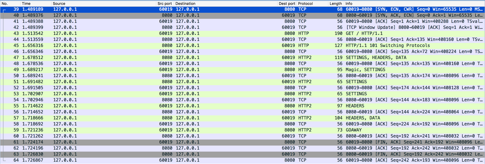
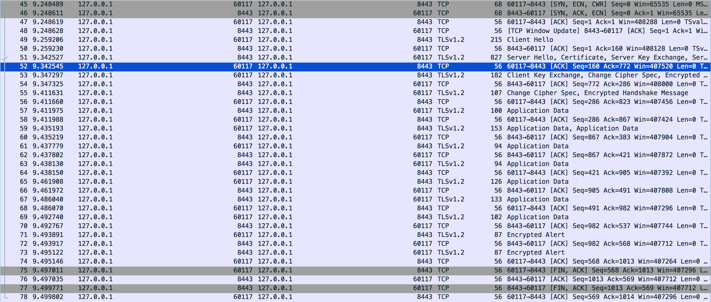

GOAL
===

Run the demo HTTP/2 server, let the HTTP/2 client communicate with this server. Check the format of HTTP/2 packets.

GUIDE
===
1. Open Wireshark and listen on localhost.
1. Set the parameter `SSL` to `false`.
1. Start the server.
1. Start the client.
1. Inspect the traffic. It should be like the following

1. Change `SSL` to `true` and repeat the previous steps, check the traffic.
